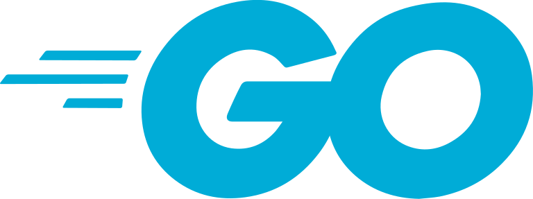

<!-- Typing animation for your intro -->
<h1 align="center">
  
</h1>

###    About Me:

  Hi, I'm David Bischof, Computer Engineer & Software Developer from Swiss / Zurich
   
   
  👨‍🎓 I'm currently in my last year of my ApprenticeShip in the IMS. For this I am working as a intern at AndeoAG.
   
  💻 I love writing code and creating cool new Apps  😊
   
  📚 I’m currently focusing on Webapps and Backend
   
  📫 How to reach me 👇

<!-- Social Links -->

  
  

<h2 align="center">🔥 Languages & Frameworks & Tools & Abilities 🔥</h2> 

  
  
  
  
  
  
  
  
  
  
  

<h2 align="center">⚡ Stats ⚡</h2> 

  

  
  <!-- GitHub Stats -->
  

